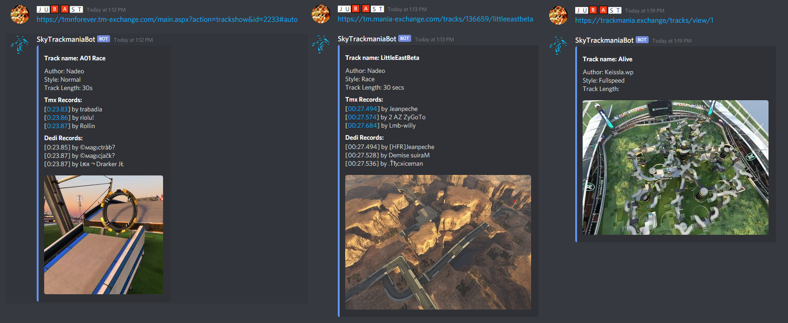

# SkyTrackmaniaBot

A Discord Bot written for the Sky Trackmania discord.  
Provides useful information about the TMX tracks shared on discord.

# Screenshots

# Usage:
Paste any TMX track url into a text channel and the bot will create an embed with some track information   
Works for `TMNF`, `TM2` and `TM2020` TMX sites

####Example URLs: 
- `https://tmnforever.tm-exchange.com/main.aspx?action=trackshow&id=2233#auto`
- `https://tm.mania-exchange.com/tracks/136659/littleeastbeta`
- `https://trackmania.exchange/maps/screenshot/normal/10`

# Remarks
The creation of this bot was only possible because of these APIs. Thanks :)
- [DSharpPlus](https://github.com/DSharpPlus/DSharpPlus) C# Discord API Library
- [Trackmania Exchange](https://trackmania.exchange/) Trackmania track-swapping website

# License
MIT